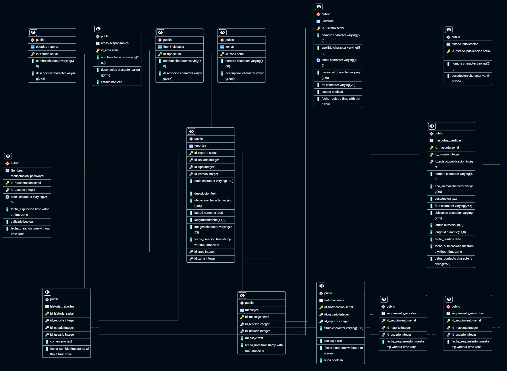

# Alerta Urbana

## Información del proyecto

**Integrante:** Cesar Gabriel Elizondo

**Documentación completa del proyecto:**
[Ver documentación en Notion](https://app.notion.com/p/Alerta-Urbana-36995fd7b79a80d0ae8fc8e5d765bc66)

## Gestión del proyecto

El proyecto será gestionado mediante GitHub Projects, donde se organizará el Product Backlog y el seguimiento de las tareas.

## Product Backlog

El Product Backlog contiene las historias de usuario y funcionalidades necesarias para el proyecto, organizadas según su prioridad y estado de avance.
## Base de datos

Alerta Urbana utiliza PostgreSQL como sistema gestor de base de datos.

El modelo de datos fue diseñado a partir de las historias de usuario y los requisitos definidos para el sistema.

La base de datos está compuesta actualmente por las siguientes tablas:

- usuarios
- tipo_incidencia
- estados_reporte
- reportes
- historial_reportes
- mensajes
- notificaciones
- estado_publicacion
- mascotas_perdidas
- areas_responsables
- zonas
- recuperacion_password
- seguimiento_reportes
- seguimiento_mascotas

### Prevención de reportes duplicados

Para evitar la creación de múltiples reportes sobre una misma incidencia, se incorporó la tabla `seguimiento_reportes`.

Esta tabla permite asociar distintos usuarios a un reporte existente, manteniendo un único reporte para la incidencia.

La misma lógica se aplica a las publicaciones de mascotas perdidas mediante la tabla `seguimiento_mascotas`.

### Diagrama Entidad-Relación

El siguiente diagrama representa las tablas, claves primarias, claves foráneas y relaciones principales de la base de datos.

